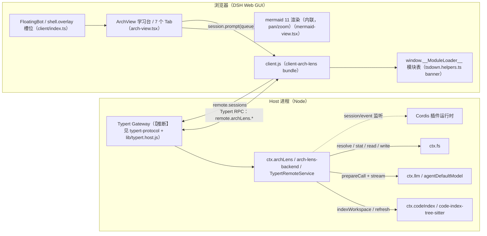
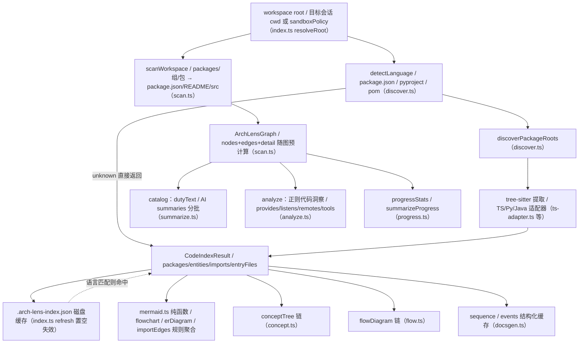
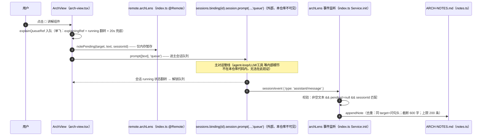
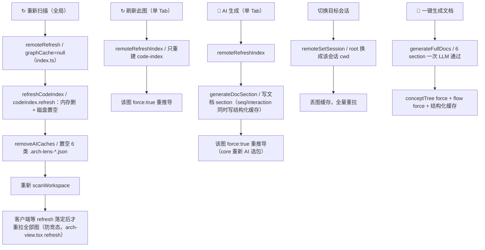
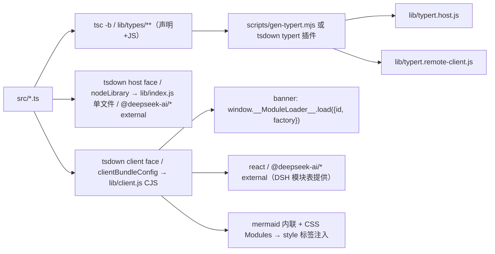

# Arch Lens 代码直读流程图（Mermaid 源码）

> 本文件由对 `packages/*` 源码的直接阅读（非 git 日志、非 node_modules、非文档转述）生成。
> 每个图节点尽量标注代码出处（`src` 路径）；标 `【推断】` 的节点是依据协议类型/生成产物推得，
> 对应实现位于本仓库之外（deepseek-harness），无法在本仓库代码内交叉验证。
> 图 4 的参与者命名已按「代码里实际出现的标识」修正，外部管线内部细节明确标注为不可见。

---

## 图 1：总体运行时拓扑

出处：`packages/arch-lens-backend/src/index.ts`、`packages/client-arch-lens/src/client/*`、
`packages/tsdown.helpers.ts`、`packages/typert-protocol/src/index.ts`。

---

## 图 2：数据管线（扫描 / 索引 → 图元）

出处：`scan.ts`、`discover.ts`、三个语言适配器、`mermaid.ts`、`docsgen.ts`、`analyze.ts`。

---

## 图 3：AI 生成链（概念树 / 流程图 / 核心选择 / 文档）

```mermaid
flowchart TD
    subgraph CONCEPT_CHAIN["概念树 conceptTree（.arch-lens-concept-&lt;lang&gt;.json）"]
        C1["缓存命中？"] -->|"是"| C_DONE["返回缓存"]
        C1 -->|"否"| C2["detectArchDocs / zh 优先候选文档（concept.ts）"]
        C2 -->|"有文档"| C3["extractDocTree / 标题层级逐字提取 / source:'doc' + ref/sourceText"]
        C2 -->|"无文档"| C4["generateFromFlow / LLM 从入口/依赖归纳 / source:'flow'"]
        C3 --> C_CACHE["写缓存"]
        C4 --> C_CACHE
    end
    subgraph FLOW_CHAIN["流程图 flowDiagram（.arch-lens-flow-&lt;lang&gt;.json）"]
        F1["缓存命中？"] -->|"是"| F_DONE["返回缓存"]
        F1 -->|"否"| F2["extractFlowBlock / 逐文档探测（flow.ts）"]
        F2 -->|"mermaid 围栏"| F3["原样渲染 source:'doc'"]
        F2 -->|"text 伪代码"| F4["LLM 仅格式转码 source:'doc'"]
        F2 -->|"都没有"| F5["generateFlowFromCode / LLM 归纳 source:'flow'"]
        F3 --> F_CACHE["写缓存"]
        F4 --> F_CACHE
        F5 --> F_CACHE
    end
    subgraph CORE_CHAIN["核心包选择 coreGraph（.arch-lens-core-&lt;lang&gt;.json）"]
        K1["缓存命中？"] -->|"是"| K_DONE["返回缓存"]
        K1 -->|"否"| K2["llmPick / 从索引摘要选 4-25 个 id / 校验后 source:'flow'"]
        K2 -->|"≥4 个"| K_DONE
        K2 -->|"失败/太少"| K3["fallbackIds / 入口包 + import 邻居 / source:'curated'"]
        K3 --> K_DONE
    end
    subgraph DOCGEN["架构文档生成 docsgen"]
        D1["resolveDocTarget / 手写 architecture.md 永不覆盖 / 落 architecture.generated.md"]
        D2["6 个 section 逐一 LLM 生成 / mergeSection 按标题替换/追加"]
        D3["seq/interaction 额外写结构化缓存"]
        D1 --> D2 --> D3
    end
```

出处：`concept.ts`、`flow.ts`、`core.ts`、`docsgen.ts`。

---

## 图 4：讲解请求 → 笔记写入闭环（纯代码可验证版）

出处：`client-arch-lens/src/client/arch-view.tsx`、`client-arch-lens/src/client/index.ts`、
`arch-lens-backend/src/index.ts`、`arch-lens-backend/src/notes.ts`。

---

## 图 5：刷新 / 失效语义

出处：`arch-lens-backend/src/index.ts`、`client-arch-lens/src/client/arch-view.tsx`、
`code-index-tree-sitter/src/index.ts`。

---

## 图 6：构建与打包

出处：`tsdown.config.ts`（根）、`packages/tsdown.helpers.ts`、`packages/arch-lens-backend/tsdown.config.ts`、
`packages/client-arch-lens/tsdown.config.ts`、`scripts/gen-typert.mjs`。

---

## 已知不一致（代码佐证）

- `packages/client-arch-lens/lib/types/` 存在 `chat-projection.*` 产物，但 `src/` 中已无此文件 —— lib 与 src 不同步（陈旧产物）。
- 根目录 `lib/index.js` 与 `packages/arch-lens-backend/lib/index.js` 为同类 bundle，helper 的 outDir 写死为包内 lib，根 lib 应为旧配置产物。
- `client-arch-lens/src/index.ts` 的 host 侧 `apply()` 为空函数（浏览器插件在 host 侧无行为），但 package.json 仍导出 `./client`。
