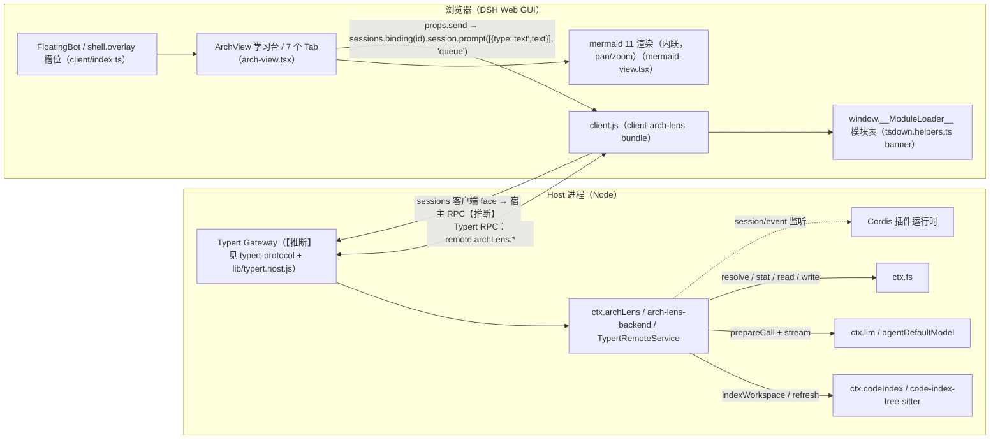
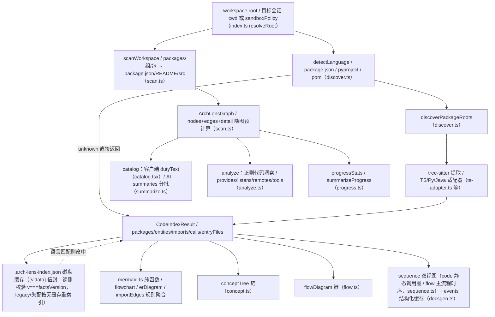
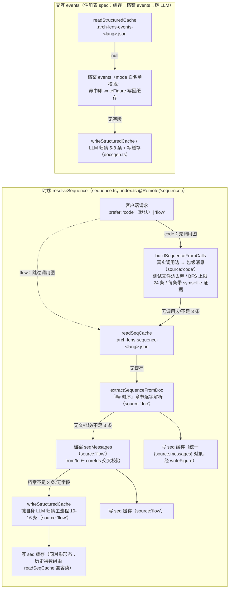
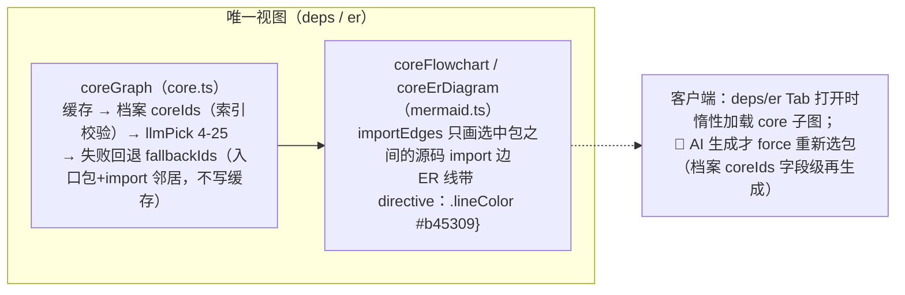
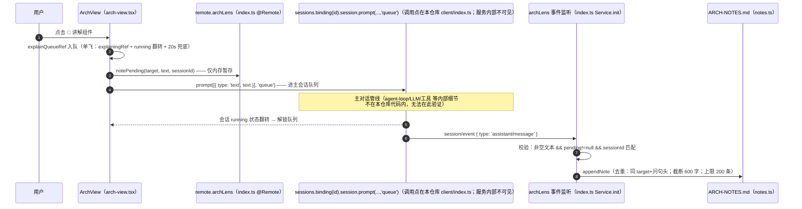
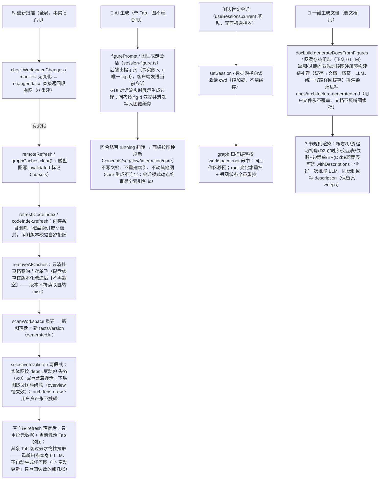
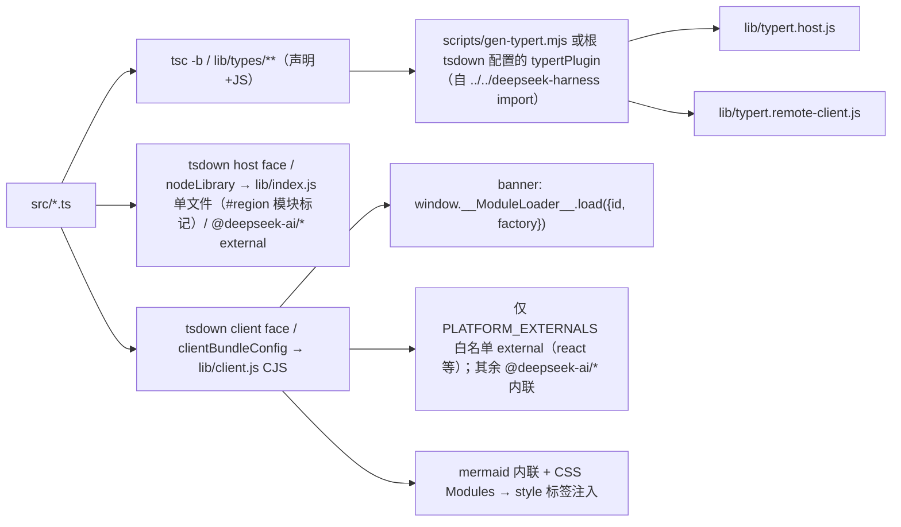
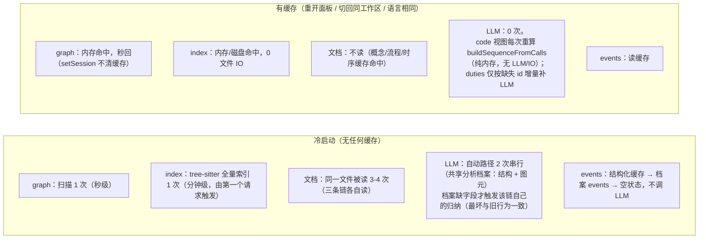
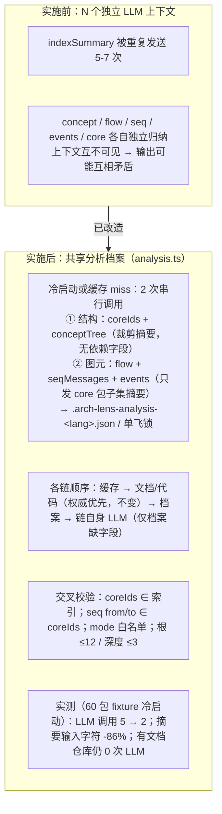

# Arch Lens 绘图机制图解（Mermaid 源码）

> 本文件由对 `packages/*` 源码的直接阅读生成，每个图节点都标注代码出处；
> 标 `【推断】` 的节点对应实现位于 deepseek-harness（本仓库之外），无法在仓库内交叉验证。
> 阅读顺序建议：速览表 → 图 3（各 Tab 总览与文件存储）→ 图 4/5/6（各图元生成链）→ 图 1/2（拓扑与数据）→ 图 7/8/9 → 第十一章（事实源与验证量化）。

---

## 一、绘图速览

**总原则：缓存优先 → 文档/代码优先 → 共享分析档案 → 链自身 LLM 兜底 → 带出处。**
每个图元 = 一条独立链，链上每阶段是独立函数（可重排可替换）；所有 AI/文档产物都落到工作区 `index/` 目录（统一缓存目录，常量 `CACHE_DIR`）下的 `.arch-lens-<kind>-<lang>.json` 磁盘缓存（`<lang>` 为净化后的角色语言，默认 `中文`）。

| Tab | 后端 Remote / 图元 | 生成链（按顺序） | 来源标记 | 磁盘缓存 | 客户端渲染 |
|---|---|---|---|---|---|
| ① 概念树 | `conceptTree` | 缓存 → 文档逐字提取（7 候选，非 English zh 优先）→ 档案 conceptTree → LLM 归纳 | `doc` / `flow` | `.arch-lens-concept-<lang>.json` | `ConceptGraph` |
| ② 时序 | `sequence`（prefer `code`/`flow`） | code 视图：静态调用图 → 缓存 → 文档「## 时序」→ 档案 seqMessages → LLM；flow 视图跳过调用图 | `code` / `doc` / `flow` | `.arch-lens-sequence-<lang>.json` | `SequenceGraph` |
| ③ 流程图 | `flow` | 缓存 → 文档围栏（mermaid 原样 / `text` 伪代码 LLM 转码）→ 档案 flow → LLM 归纳 | `doc` / `flow` | `.arch-lens-flow-<lang>.json` | `MermaidView` |
| ④ 交互 | `events` | 结构化缓存 → 档案 events → null（空状态）；AI 生成（`refreshIndex` + `generateDocSection('interaction')`）写结构化缓存 | `flow` | `.arch-lens-events-<lang>.json` | `InteractionGraph` |
| ⑤ 依赖 | `mermaidCore`（overview）/ `mermaidIndexed`（full，失败回退 `mermaidDeps`） | overview：核心选包（缓存 → 档案 coreIds → LLM 4–25 → curated 回退）+ `importEdges` 画边；full：import 全量 → 失败回退扫描 peerDeps 图 | `flow` / `curated` | `.arch-lens-core-<lang>.json` | `MermaidView`（overview/full 切换） |
| ⑥ ER | `mermaidCore` / `mermaidIndexed`（失败回退 `mermaidEr`） | 同依赖（实体图） | `flow` / `curated` | `.arch-lens-core-<lang>.json` | `MermaidView` |
| ⑦ 目录 | `graph` + `summarizeDuties` | 扫描节点 blurb（zh 优先）→ `dutyText`；AI 职责总结（缓存 + 分批 40/调用 2 批） | `flow` | `.arch-lens-summaries-<lang>.json` | `Catalog` |

共享分析档案（`analysis.ts`，`.arch-lens-analysis-<lang>.json`）是 ①–⑥ 的公共 LLM 兜底：两次串行调用（结构 = coreIds+conceptTree；图元 = flow+seq+events）喂五条链，单飞锁共享，见第十一章。

**来源标记含义**（客户端据此打徽标，讲解时作为证据引用）：
- `doc` = 架构文档原文（逐字提取/原样渲染，权威，带 `ref` 锚点 + `sourceText`）；
- `code` = 真实静态调用图（代码事实，权威）；
- `flow` = LLM 从代码元数据归纳（**非权威**）；
- `curated` = 确定性规则回退（入口包 + import 邻居，**非权威**）。

---

## 二、图 1：总体运行时拓扑



出处：`packages/arch-lens-backend/src/index.ts`、`packages/client-arch-lens/src/client/*`、
`packages/tsdown.helpers.ts`、`packages/typert-protocol/src/index.ts`。

---

## 三、图 2：数据管线（扫描 / 索引 → 图元）



出处：`scan.ts`、`discover.ts`、三个语言适配器、`mermaid.ts`、`docsgen.ts`、`analyze.ts`。

---

## 四、图 3：各 Tab 绘图总览（核心图：7 类实体图 + 动态总览）

> 事实源 → 各 Tab 的生成链 → 客户端渲染。实线为主路径，虚线为兜底/依赖。
> 全量细节见图 4（AI 链）、图 5（时序/交互）、图 6（依赖/ER）。

```mermaid
flowchart TB
    subgraph FACTS["事实源"]
        SCAN["扫描图 graph<br/>scanWorkspace / peerDeps 边 / README（scan.ts）"]
        CI["代码索引 index<br/>code-index-tree-sitter / .arch-lens-index.json"]
        DOC["架构文档<br/>detectArchDocs 7 候选 / 非 English zh 优先（concept.ts）"]
        LLM["LLM<br/>agentDefaultModel.currentSelection + prepareCall/stream"]
        PROFILE["共享分析档案（analysis.ts）<br/>.arch-lens-analysis-&lt;lang&gt;.json<br/>2 次串行调用：结构 + 图元 / 单飞锁"]
    end
    subgraph T1["① 概念树 concepts"]
        direction TB
        T1A["缓存 .arch-lens-concept-&lt;lang&gt;.json"]
        T1B["extractDocTree<br/>标题层级逐字提取 / ref 锚点 + sourceText"]
        T1P["档案 conceptTree（source:'flow'）"]
        T1C["generateFromFlow<br/>链自身 LLM 归纳（仅档案无字段时）"]
        T1D["ConceptGraph"]
        T1A -->|"未命中"| T1B
        T1B -->|"无文档/无标题"| T1P
        T1B -->|"source:'doc'"| T1D
        T1P -->|"无字段"| T1C
        T1P -->|"source:'flow'"| T1D
        T1C -->|"source:'flow'"| T1D
    end
    subgraph T2["② 时序 seq（code / flow 双视图）"]
        direction TB
        T2A["buildSequenceFromCalls<br/>静态调用图 / 排除测试边 / BFS"]
        T2B["缓存 .arch-lens-sequence-&lt;lang&gt;.json"]
        T2C["extractSequenceFromDoc<br/>「## 时序」章节逐字解析"]
        T2P["档案 seqMessages<br/>from/to ∈ coreIds 交叉校验"]
        T2D["链自身 LLM 归纳 10-16 条<br/>（仅档案不足 3 条时）"]
        T2E["SequenceGraph"]
        T2A -->|"source:'code'；无则"| T2B
        T2B -->|"无则"| T2C
        T2C -->|"source:'doc'；无则"| T2P
        T2P -->|"不足 3 条"| T2D
        T2D -->|"source:'flow'"| T2E
        T2A --> T2E
        T2B --> T2E
        T2C --> T2E
        T2P -->|"source:'flow'"| T2E
    end
    subgraph T3["③ 流程图 flow"]
        direction TB
        T3A["缓存 .arch-lens-flow-&lt;lang&gt;.json"]
        T3B["extractFlowBlock<br/>mermaid 围栏原样 / text 伪代码 LLM 转码"]
        T3P["档案 flow（source:'flow'）"]
        T3C["generateFlowFromCode<br/>链自身 LLM 归纳（仅档案无字段时）"]
        T3D["MermaidView"]
        T3A -->|"未命中"| T3B
        T3B -->|"无围栏块"| T3P
        T3B -->|"source:'doc'"| T3D
        T3P -->|"无字段"| T3C
        T3P -->|"source:'flow'"| T3D
        T3C -->|"source:'flow'"| T3D
    end
    subgraph T4["④ 交互 interaction"]
        direction TB
        T4A["readStructuredCache<br/>.arch-lens-events-&lt;lang&gt;.json"]
        T4P["档案 events（mode 白名单校验）"]
        T4B["🤖 AI 生成：档案 events 字段级再生成"]
        T4C["InteractionGraph<br/>（事件框两行：事件名 + 中文 note 概要）"]
        T4A -->|"null"| T4P
        T4A --> T4C
        T4P -->|"无字段"| T4B
        T4P --> T4C
        T4B --> T4C
    end
    subgraph T5["⑤ 依赖 deps（仅核心子图，无 full 视图）"]
        direction TB
        T5A["coreGraph 选包<br/>缓存 → 档案 coreIds（索引校验）→ LLM 4-25 → curated 回退"]
        T5B["coreFlowchart<br/>importEdges 只画选中包"]
        T5E["MermaidView"]
        T5A --> T5B --> T5E
    end
    subgraph T6["⑥ ER er（仅核心子图，无 full 视图）"]
        direction TB
        T6A["coreErDiagram<br/>选中包实体（ER 线色 directive 保证可见）"]
        T6D["MermaidView"]
        T6A --> T6D
    end
    subgraph T7["⑦ 目录 catalog"]
        direction TB
        T7A["扫描节点 blurb / blurbZh"]
        T7B["dutyText 本地化职责"]
        T7C["summarizeDuties<br/>LLM 分批 40/调用 2 批"]
        T7D["Catalog"]
        T7A --> T7B --> T7D
        T7C --> T7D
    end
    DOC -.-> T1B
    DOC -.-> T2C
    DOC -.-> T3B
    LLM -.-> T1C
    LLM -.-> T2D
    LLM -.-> T3C
    LLM -.-> T4B
    LLM -.-> T5A
    LLM -.-> T7C
    PROFILE -.-> T1P
    PROFILE -.-> T2P
    PROFILE -.-> T3P
    PROFILE -.-> T4P
    PROFILE -.-> T5A
    SCAN --> T7A
    SCAN -.-> T5D
    SCAN -.-> T6C
    CI -.-> T2A
    CI -.-> T5A
    CI -.-> T5C
    CI -.-> T6B
```



出处：`concept.ts`、`flow.ts`、`sequence.ts`、`core.ts`、`mermaid.ts`、`docsgen.ts`、`summarize.ts`、
`arch-lens-backend/src/index.ts`（Remote 面）、`client-arch-lens/src/client/arch-view.tsx`（Tab 组装）。

### 图 3 附：Tab 间关系与图文件存储（重构定稿）

> **数据同源、文件分立、版本绑定**：所有 Tab 共用同一次 `code-index` 扫描（`.arch-lens-index.json` 的 `{v,data}` 信封：包 / 实体 / imports / 调用边），
> 每类图只是同一份事实的"投影"；但每类图独立落盘、独立渲染、独立触发。**清单、文件名、deps 规则、构建入口的唯一来源 = `figures.ts` 图注册表**（禁止任何模块再手拼缓存名）。

| Tab | 注册表 id | 数据来源（投影） | 磁盘缓存（实体级统一为版本信封 `{v, deps?, data}`） |
|---|---|---|---|
| ⚡ 总览 | （动态图） | 规则 overview / 会话生成 | `.arch-lens-dynamic-overview-<hash>[-<lang>].json`（`{v,deps,data}`，deps=全部包） |
| ① 概念树 | `concepts` | index → 文档 / 档案 / LLM（层级投影） | `.arch-lens-concept-<lang>.json`（deps=全部包） |
| ② 调用关系图 | （非注册表） | `callGraph` remote：真实调用边直读索引，零 LLM 不落缓存 | —（读 `.arch-lens-index.json`） |
| ② 主流程时序 | `seq` | 缓存 → 文档「## 时序」→ 档案 → LLM（叙事投影，`prefer:'flow'`） | `.arch-lens-sequence-<lang>.json`（data = `{source,messages}`；deps=端点包） |
| ③ 流程图 | `flow-event` / `flow-pipeline` | 文档围栏 / 档案 / LLM（流程投影） | `.arch-lens-flow-<lang>-<angle>.json`（doc 源 deps=[] 永不失效；AI 源=全部包） |
| ④ 交互 | `interaction` | 缓存 → 档案 events → LLM（事件投影） | `.arch-lens-events-<lang>.json`（data=事件数组；deps=生产者/消费者） |
| ⑤⑥ 依赖/ER | `core` | coreGraph 选包 + importEdges（子图投影） | `.arch-lens-core-<lang>.json`（deps=选中 ids；curated 回退不写缓存） |
| ⑦ 目录 | `duties` | 扫描 blurb + AI 职责摘要（列表投影） | `.arch-lens-summaries-<lang>.json`（deps=已总结包） |

- **共享的拉取**：`loadSequences()` 一次并行取时序双视图；「⚡ 变动更新」按注册表逐图查 `isFigureCacheValid`，失效才重画；flow 双视角在同一轮生成里一起出。真正分立的只有三点：独立缓存文件、独立渲染面板、独立 AI 触发。
- **信封语义**（`fact-cache.ts`）：读命中 = `v === factsVersion`（扫描图 generatedAt，只有 refresh 推进）；`v:0` = 失效标记；**缺 `deps` = legacy = 依赖全部包**；`deps:[]` = 永不失效。写侧唯一入口 `writeFigure`（注册表名 + `figureDeps` 规则；失败抛出）；🔬 方法级 = 同名 `-methods` 文件（按需生成，不进变动更新）。
- **动态/用户文件命名**：🎨 hover 下钻 `index/.arch-lens-dynamic-<kind>-<hash>[-<lang>].json`（**也是版本信封**，deps 规则 `dynamicFigureWriteFacts`，失效随父图级联，读取版本不符 → 下次 hover 自动重生成）；💾 保存图 `index/.arch-lens-draw-<figureId>-<lang>.json` 为用户资产，**失效逻辑永不触碰**。


---

## 五、图 4：AI 生成链详解（概念树 / 流程图 / 核心选择 / 文档）


出处：`concept.ts`、`flow.ts`、`core.ts`、`figures.ts`（注册表/统一写路径）、`docbuild.ts`。

流程图 Tab 的 AI 归纳路径支持**两个视角（角度）**，提示词规则见 `flow-angle.ts`（档案与链共用）：
- **事件驱动**：节点 = 事件/触发点，边标注触发/消费关系与模式（emit/waterfall/parallel/serial）；
- **数据管道**：节点 = 数据产物（源码文件 → 实体/边 → 索引结果 → 档案 → 图数据），边标注转换动作。

每个角度都强制「subgraph 按**阶段**分组（不是按包）+ 节点 ≤16（「动词+宾语」一句话，不写裸函数名）+ 每条边带动作标签 + 单主线无环」。**两视角在档案图元调用中一次生成**（`flow: { event, pipeline }`），角度 chip 是纯本地切换（零 LLM，选择持久化 localStorage）；「🤖 AI 生成」一次调用同时重生成两视角。文档流程（`source:'doc'`）角度无关且优先。另外「⏹ 终止」按钮通过 `abort.ts` 的 AbortSignal 真正掐断 provider 流（所有 LLM 调用点都挂 signal，见机制 10）。

---

## 六、图 5：时序双视图与交互链



出处：`sequence.ts`、`docsgen.ts`、`figures.ts`（D5：seq/interaction 与其余图同一条注册表链，「⚡ 变动更新」会补建它们）、`arch-lens-backend/src/index.ts`。

---

## 七、图 6：依赖 / ER 核心子图（无全量视图）

> 依赖与 ER Tab 都已去掉全量视图（实体/包级全量图学习价值低）：只渲染核心子图
> `coreFlowchart` / `coreErDiagram`。三个 ER 生成函数输出带 `%%{init}` 线色 directive
> （深琥珀 `#b45309`），避免 import 线与背景同色不可见。



出处：`core.ts`、`mermaid.ts`、`arch-lens-backend/src/index.ts`、`client-arch-lens/src/client/arch-view.tsx`。

---

## 八、图 7：讲解请求 → 笔记写入闭环



出处：`client-arch-lens/src/client/arch-view.tsx`、`client-arch-lens/src/client/index.ts`、
`arch-lens-backend/src/index.ts`、`arch-lens-backend/src/notes.ts`。

---

## 九、图 8：刷新 / 失效语义（按钮三件套）

> 界面只保留三个心智动作：**旧了就重扫（↻ 重新扫描）· 图不满意就 AI 生成（🤖）· 要文档就一键生成（📄）**。
> 「↻ 重载」「↻ 刷新此图」已删除（与切会话重复 / 对 AI 图几乎无效）。



出处：`arch-lens-backend/src/index.ts`（`remoteRefresh`）、`fact-cache.ts`（`selectiveInvalidate`）、`docbuild.ts`、`client-arch-lens/src/client/arch-view.tsx`、
`code-index-tree-sitter/src/index.ts`。

---

## 十、图 9：构建与打包



出处：`tsdown.config.ts`（根）、`packages/tsdown.helpers.ts`、`packages/arch-lens-backend/tsdown.config.ts`、
`packages/client-arch-lens/tsdown.config.ts`、`scripts/gen-typert.mjs`。

---

## 十一、事实源、缓存与 LLM 上下文（已实施 + 验证量化）

> 说明：本节所有 `.arch-lens-*.json` 均位于工作区 `index/` 目录（`CACHE_DIR`），为简洁不再逐个加前缀。

### 图 10：事实源与 LLM 上下文全景（实施后）

> 结论：**扫描图与代码索引是共享事实源；`factsVersion`（扫描图 generatedAt）+ 版本信封 `{v,deps,data}` 是唯一事实真相——每个缓存都盖着生成时的事实戳，只有 `refresh()` 能推进版本并重盖章/级联失效；图清单/文件名/deps 规则/构建入口的唯一来源是 `figures.ts` 注册表。LLM 归纳收敛为共享分析档案的 2 次串行调用（结构 + 图元），链自身 LLM 只在档案缺字段时兜底；「📄 一键生成文档」是图缓存的纯组装（正文零 LLM）。LLM 从不直接读代码文件——"找代码"由 tree-sitter 一次性完成，LLM 只吃规则生成的摘要字符串。**


出处：`arch-lens-backend/src/index.ts`（写路径 Remote 先 `indexWorkspaceShared`：信封 v ≠ factsVersion 时 refresh+重建一次）、
`fact-cache.ts` / `figures.ts`（事实脊柱）、`concept.ts` / `flow.ts` / `sequence.ts` / `docsgen.ts` / `core.ts` / `summarize.ts` / `docbuild.ts`。

### 图 11：第一次打开面板（无任何缓存）的冷启动时序

> 每个 Tab 各自发请求、各自走链，但底层共享：扫描 1 次、索引 1 次（由最先到达的请求触发，其余等待同一个 Promise）。
> 有架构文档的仓库：概念/流程/时序段走文档路径，0 次 LLM；无文档仓库落到共享分析档案（2 次串行 LLM），档案缺失的字段才由各链自己的 LLM 兜底。

```mermaid
sequenceDiagram
    autonumber
    participant V as ArchView（挂载/切会话）
    participant R as remote.archLens（Host）
    participant G as scanWorkspace
    participant I as codeIndex（tree-sitter）
    participant D as 架构文档
    participant L as LLM
    participant P as 分析档案 analysis.ts
    participant C as 磁盘缓存 .arch-lens-*.json

    V->>R: setSession(sessionId) → loadAllFigures
    V->>R: 并行发：graph + conceptTree + sequence(code) + sequence(flow) + flow + events + notes + promptConfig + analyze
    R->>G: graph()：内存 miss → 扫描 1 次（秒级）→ 写内存缓存（此后所有请求共享）
    R->>I: 最先到达的请求（通常 conceptTree）触发 indexWorkspace 全量索引（分钟级）
    Note over R,I: 其余请求 await 同一个 Promise（单飞）→ 索引完成后写 .arch-lens-index.json
    R->>D: conceptTree：detectArchDocs → extractDocTree（读文档 #1）
    R->>D: flow：extractFlowBlock（读文档 #2）
    R->>D: sequence(code)+sequence(flow)：extractSequenceFromDoc（读文档 #3/#4）
    R->>P: 无文档/无块/无 calls 时：确保档案（单飞锁，并发链共享同一次生成）
    R->>L: 档案生成 = 2 次串行调用：结构（coreIds+conceptTree，裁剪摘要）→ 图元（flow+seq+events，core 子集摘要）
    P->>C: 写 .arch-lens-analysis-&lt;lang&gt;.json；各链命中档案后写回自己的缓存
    Note over R,L: 档案缺字段才调用该链自己的 LLM 归纳（最坏情况与旧行为一致）
    Note over V: 交互 Tab：结构化缓存 → 档案 events → 空状态（不调 LLM）。<br/>deps/ER/catalog：切 Tab 时才惰性加载（core 从档案/缓存取、duties 分批 LLM）
```

### 图 12：有缓存 vs 无缓存



出处：`arch-lens-backend/src/index.ts`（`graphCaches` / `graphInFlight`、`refreshCodeIndex`、`removeAICaches`）、
`code-index-tree-sitter/src/index.ts`（内存 Promise 缓存 + 磁盘缓存）、`client-arch-lens/src/client/arch-view.tsx`（`loadAllFigures`）。

### 图 13：省 token 不丢准确性的方案（共享分析层）—— 已实施 ✅



**已实施部分**：
- **A｜共享分析层**：`analysis.ts` 的 `ensureAnalysisProfile`（2 次串行调用 + 字段校验 + 单飞锁 + `.arch-lens-analysis-<lang>.json` 版本信封缓存），concept/flow/seq/core/events 五条链全部在权威阶段之后、链自身 LLM 之前消费档案；重扫只清档案的内存单飞（`removeAICaches`），磁盘副本靠版本校验拒旧。
- **B｜索引摘要按需裁剪**：`indexSummary(index, { packages, fields, maxPackages, maxDeps })` 参数化；core/seq/interaction/flow 调用均去掉依赖字段；concept 兜底依赖 5→3。（原"docs 六个 section 用全量摘要"已随阶段 4 消失：文档改为图缓存纯组装，不再发全量摘要。）
- **C/D（未实施，可选叠加）**：文档单次读入内存（消除 3-4 次重复读取）；索引按需分层（浅索引供摘要、全量推迟）。

### 验证与量化（单元测试可复现）

`pnpm exec vitest run --pool=threads`（218 tests，含重构各阶段新增的注册表/信封/统一写路径/级联失效/文档组装回归）。核心量化测试与实测数字：

| 指标 | 实施前（口径） | 实施后（实测） | 出处 |
|---|---|---|---|
| 冷启动自动路径 LLM 调用次数 | 5（concept + seq×2 + flow + core；不含惰性 duties） | **2**（串行：结构 + 图元） | `analysis-chain.spec.ts` |
| 摘要输入字符总量 | 5 × 全量摘要 ≈ 53,075 字符 | **7,373 字符**（-86%）；独立预算口径（含 concept entryLines）**-92%** | `analysis-chain.spec.ts` / `summary.spec.ts` |
| 有文档仓库 LLM 调用 | 0 | **0**（文档优先不破坏） | `analysis-chain.spec.ts` |
| 有缓存重开面板 LLM 调用 | 0 | 0（行为不变） | 链读取顺序未变 |
| 反编造校验 | coreIds ∈ 索引；seq 硬约束 | 全保留 + **seq from/to ∈ coreIds 交叉校验**、events mode 白名单、概念树根 ≤12/深度 ≤3 | `analysis.spec.ts` |

验证方式说明：
- **链级计数**：mock `docsgen.llmText` 记录每次 prompt，冷启动跑五条链断言恰好 2 次调用、第二次只发送 core 子集摘要，并对比 5×全量摘要的字符预算；
- **准确性不变量**：`analysis.spec.ts` 逐条断言档案 sanitizer（编造 id 丢弃、自环丢弃、mode 白名单、根/深度上限、标题 trim、版本校验）；
- **权威顺序不变量**：有文档/calls 时断言 0 次 LLM 且 source 为 `doc`/`code`——档案永远排在权威源之后。
- 真实 LLM 效果需在部署环境实测（本仓库无法访问模型），以上数字是 prompt 构造层面的确定性下界。

---

## 十二、重构补记（阶段 0–5）：唯一事实真相与废弃面

本次重构把"图从哪来、写到哪、何时失效"收敛为**唯一一套事实**，对应新增回归测试（`figure-registry.spec.ts` / `write-unify.spec.ts` / `index-facts.spec.ts` / `envelope.spec.ts` / `selective-invalidate.spec.ts` / `docsgen.spec.ts`）：

1. **唯一图清单与文件名**：`figures.ts FIGURE_SPECS`（7 实体图）；名字一律委托链模块导出（`conceptCacheName`/`flowCacheName`/`seqCacheName`/`eventsCacheName`/`coreCacheName`/`summariesCacheName`）。`session-figure.ts` 的手写镜像名与 `followup.ts` 的本地拼名已删——旧镜像在无视角时产出过永远读不中的 `.arch-lens-flow-<lang>.json`（注册表委托后修复：无视角 = event）。
2. **唯一写路径**：`writeFigure`（注册表名 + `figureDeps` 规则 + `writeVersionedCache`，失败抛出）；链内写、会话回答、追问重画、文档补建共用。`factsVersion` 于生成开始时读取并沿链传递，防止"中途重扫、旧产物盖新戳"。
3. **唯一失效真相**：`refresh()` 推进 `factsVersion`；`selectiveInvalidate` 两段式（实体 deps 命中失效或重盖章 → 记录被失效图种；下钻图级联 + overview 恒失效 + legacy 标记 v:0；`.arch-lens-draw-*` 与 skip 集不碰）。
4. **文档单向**：`docbuild.ts` 组装（缺图→该图链补建→渲染），文档不反哺图缓存；`description?` 为对象图（flow/seq/core）的 D3 扩展点。
5. **索引信封**：provider 以 `{v,data}` 落盘（v=0 拒写），`callGraph` 校验版本与语言，legacy 视同 stale。

**废弃面（D6：wire 保留、不再演进，客户端如有调用请迁移）**：

| 面 | 现状 | 替代 |
|---|---|---|
| `@Remote('mermaidDeps')` / `('mermaidEr')` / `('mermaidIndexed')` | 全量视图规则图，学习价值低 | `mermaidCore`（核心子图）|
| `resolveSequence` 的 `prefer:'code'` 分支 | 注册表链固定 `prefer:'flow'` | `callGraph` remote 独立呈现真实调用边 |
| `index/` 目录历史遗留文件（如旧版无视角的 `.arch-lens-flow-default.json`） | 不再有任何读写方，无害 | 版本校验下自然永不被读，可随手删 |

**已按用户决定保留不动**：「🔁 全量重建」语义（`generateAll(incremental=false)` 无条件重绘）、方法级（`-methods`）按需生成路径（D7）。
