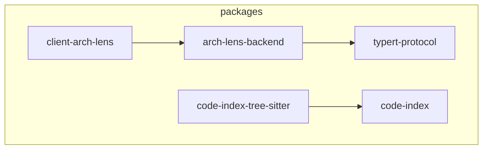

<!-- arch-lens generated · chapter=deps · language=中文 · at=2026-09-01T14:06:29.532Z · 本文件由 Arch Lens 生成并整体覆盖，请勿手改 -->

# 依赖

## 依赖

### 依赖概览

系统由五个包构成，依赖关系形成两条清晰的主链路：服务端链路与客户端链路。

- `arch-lens-backend` 作为服务端入口，直接依赖 `code-index` 与 `typert-protocol`。它负责扫描工作区仓库、展示组件细节并记录 `ARCH-NOTES.md` 答案，因此需要借助 `code-index` 提供语言感知的实体与导入提取能力，并通过 `typert-protocol` 定义与编译器无关的远程元数据协议。
- `client-arch-lens` 作为浏览器端学习桌，依赖 `arch-lens-backend` 与 `typert-protocol`。它通过远程主机展示概念、时序、交互和目录等学习单元，一方面调用服务端获取数据，另一方面直接复用协议类型以保证通信契约一致。
- `code-index-tree-sitter` 依赖 `code-index`，为 `code-index` 定义的导入提取契约提供 tree-sitter 实现，支持 TypeScript、Python、Java 三种语言。

### 依赖表

| 调用方 | 被调用方 | 动作 |
| --- | --- | --- |
| arch-lens-backend | code-index | 使用语言感知实体与导入提取能力 |
| arch-lens-backend | typert-protocol | 使用远程元数据协议 |
| client-arch-lens | arch-lens-backend | 调用服务端接口 |
| client-arch-lens | typert-protocol | 复用协议类型定义 |
| code-index-tree-sitter | code-index | 实现提取契约 |

### 关键路径

一次完整的端到端流程为：`client-arch-lens` 向 `arch-lens-backend` 发起请求，服务端调用 `code-index` 获取工作区实体与导入关系，`code-index` 的实际提取工作由 `code-index-tree-sitter` 完成；同时，`arch-lens-backend` 与 `client-arch-lens` 均通过 `typert-protocol` 保证交互数据的结构一致。该路径明确了浏览器端、服务端、语言提取层与协议层之间的职责边界。

### 设计取舍

- `code-index` 被设计为纯契约接口，不关心具体语法解析实现；`code-index-tree-sitter` 作为唯一实现方，使得未来可替换为其他解析器而不影响上层服务。
- `typert-protocol` 同时被服务端与客户端依赖，将协议独立成包，避免了将协议定义耦合在具体后端中，从而支持编译器无关的远程元数据交换。
- 核心流包（图缓存）涵盖全部五个包，表明它们共同参与架构学习桌的核心数据流，任何一方的缺失都会破坏端到端能力。

依赖整体呈现自下而上的层次：最底层为 `code-index`（契约）及其实现 `code-index-tree-sitter`，中间为协议层 `typert-protocol`，上层为 `arch-lens-backend`，最上层为 `client-arch-lens`。每一层只依赖其直接下层，未出现跨层跳转，保持了良好的架构边界。

## 图示

