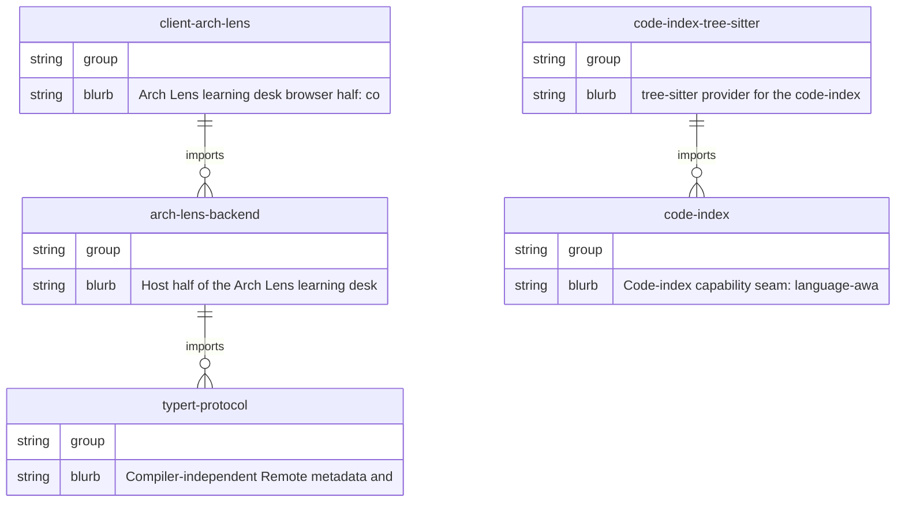

<!-- arch-lens generated · chapter=er · language=中文 · at=2026-09-01T14:07:01.393Z · 本文件由 Arch Lens 生成并整体覆盖，请勿手改 -->

# 实体关系

## 实体关系

### 包级边界与职责划分

系统以 `arch-lens-backend` 为服务端核心，负责工作区扫描、文档生成与答案记录；`client-arch-lens` 为浏览器端，通过远程主机展示学习单元。二者共享由 `code-index` 定义的语言感知实体与导入提取契约，该契约作为能力接缝，由 `code-index-tree-sitter` 提供针对 TypeScript、Python、Java 的具体实现。`typert-protocol` 则定义了与编译器无关的远程元数据及 Typert 提供者协议，为服务端与前端间的元数据交换提供稳定边界。

`code-index` 不直接绑定具体语言实现，而是通过接缝让 `arch-lens-backend` 在分析工作区时调用统一的实体与导入接口；`code-index-tree-sitter` 作为该接缝的实现者，向上承接 `code-index` 的契约，向下解析源码文件。`typert-protocol` 独立于两者，仅描述协议本身，避免与具体语言或服务端逻辑耦合。

### 文件级实体归属

`arch-lens-backend` 内的功能按文件聚合，各文件承担明确职责：

- `abort.ts`：集中管理生成过程的中止信号与阶段报告，包括 `generationSignal`、`abortGeneration`、`beginGenerationStage`、`endGenerationStage`、`waitForGenerationStatus` 等，构成生成流程的协同控制面。
- `analysis.ts`：定义分析配置与流程，提供 `AnalysisEvent`、`AnalysisFlow`、`ArchLensAnalysisProfile` 等接口，以及 `ensureAnalysisProfile`、`buildProfileConceptTree`、`generateStructure`、`generateFigures` 等函数，负责将分析意图转化为结构化数据。
- `analyze.ts`：提供 `analyzePackage` 与 `analyzeWorkspace`，是工作区分析的入口。
- `change-pack.ts`：通过 `computeChangedPackages` 和 `packageOfRel` 识别变更包，服务于增量式文档生成。
- `concept.ts`：构建概念树，包含 `ConceptTreeNode` 类型与 `docCandidates`、`extractDocTree`、`readConceptTree`、`conceptTree` 等函数，组织文档概念层级。
- `core.ts`：提炼核心实体图，`extractCoreJson`、`readCore`、`coreGraph` 等函数支撑核心描述。
- `doc-hallucination.ts`：检测文档中的幻觉，通过 `checkDocProse`、`checkEdgeTables` 等函数比对 `DocGroundTruth` 与 `DocViolation`。
- `docchapter.ts`：文档章节生成的聚合地，从 `buildGroundTruth`、`chapterPackageDeps`、`conceptFacts`、`seqFacts`、`flowFacts`、`erFacts` 等提取事实，经 `chapterPrompt`、`generateDocChapter`、`generateDocChapters` 产出章节内容，并以 `readChapterCache` 支持缓存。
- `docsgen.ts`：负责整体文档生成调度，定义 `IndexSummaryOptions`、`ReasoningCapability`，提供 `indexSummary`、`llmText`、`seqInductionPrompt` 等，决定推理强度与缓存命名。

### 关键路径与设计取舍

典型路径：`arch-lens-backend` 先经 `analyzeWorkspace`/`analyzePackage` 触发分析，结合 `code-index` 接缝获取实体与导入关系；随后 `docchapter.ts` 中的事实提取函数（如 `pathEntitiesFacts`、`depsFacts`）依据 `code-index` 数据构建章节上下文；最终由 `docsgen.ts` 组织多章节并调用 `generateDocChapters` 落地为 `docs/architecture-<章>.generated.md`。此过程中，`abort.ts` 贯穿全程，使长任务可被安全中止，且阶段进度可被前端通过 `notify`/`reportGeneration` 感知。

设计上，将代码索引能力隔离在 `code-index` 接缝之后，使 `arch-lens-backend` 不依赖具体语言解析器；`typert-protocol` 独立于服务端，确保元数据协议可被前端复用。幻觉检测被独立成 `doc-hallucination.ts`，避免污染文档生成核心流程。各文件只暴露最小实体集合，通过函数名与参数类型隐式约束关系，降低模块间耦合。

未提供任何实体间的显式调用表，因此上述关系均源自文件职责与包描述，不涉及具体函数调用方向。

## 图示

