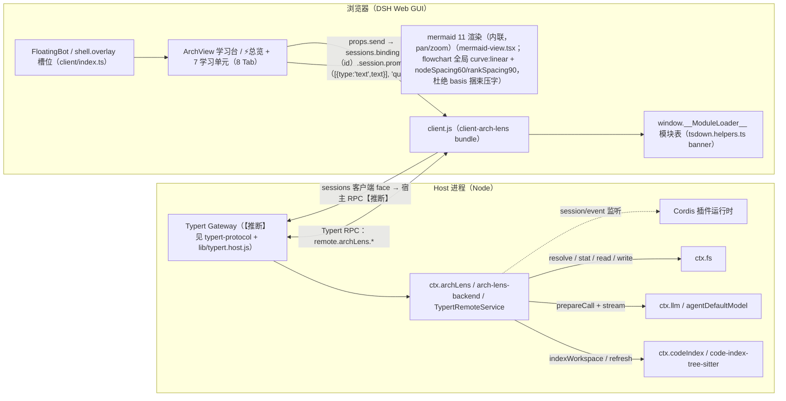

<!-- arch-lens generated · chapter=flow · language=中文 · at=2026-09-01T14:06:47.717Z · 本文件由 Arch Lens 生成并整体覆盖，请勿手改 -->

# 流程图

## 流程图

### 总体边界
`arch-lens-backend` 与 `client-arch-lens` 分别承担服务端与浏览器端的职责，二者通过 `typert-protocol` 定义的远程元数据契约通信。`code-index` 是语言感知索引的抽象接缝，`code-index-tree-sitter` 为其提供 Tree-sitter 实现；`arch-lens-backend` 只依赖抽象接缝，不绑定具体解析器。

### 调用关系
真实源码 import 边明确了各包的依赖方向：

| 调用方 | 被调用方 | 动作 |
| --- | --- | --- |
| arch-lens-backend | code-index | 请求代码索引与依赖解析 |
| arch-lens-backend | typert-protocol | 实现/使用远程协议 |
| client-arch-lens | arch-lens-backend | 经协议发起后端服务请求 |
| client-arch-lens | typert-protocol | 直接读取协议元数据与类型 |
| code-index-tree-sitter | code-index | 实现接缝，返回实体与导入边 |

`code-index` 与 `code-index-tree-sitter` 的方向为“实现依赖抽象”，因此 import 边只有 `code-index-tree-sitter -> code-index`，反向依赖不存在。

### 关键路径
以学习桌的生成请求为例，黄金路径为：
1. `client-arch-lens` 调用 `typert-protocol` 发起生成请求；
2. `typert-protocol` 将信号传递至 `arch-lens-backend`；
3. `arch-lens-backend` 通过 `code-index` 请求代码索引；
4. `code-index` 委托 `code-index-tree-sitter` 收集源码文件；
5. `code-index-tree-sitter` 返回源码文件，`code-index` 再请求解析依赖关系，得到调用边；
6. `code-index` 汇总索引结果返回给 `arch-lens-backend`；
7. `arch-lens-backend` 向 `typert-protocol` 发送通知，最终由 `client-arch-lens` 接收尾部预览。

该路径中，`arch-lens-backend` 是服务端中枢，其内部既消费 `code-index` 的输出，也通过 `typert-protocol` 与浏览器端交互。`client-arch-lens` 不直接触碰索引实现，只依赖协议与后端服务。

### 设计取舍
- 语言无关性：`code-index` 定义接缝，`code-index-tree-sitter` 只负责 TypeScript/Python/Java 的具体提取，使 `arch-lens-backend` 可替换解析器而不影响上层。
- 协议单一来源：`typert-protocol` 同时被前后端引用，保证远程元数据定义一致，避免重复建模。
- 单向依赖：浏览器端 `client-arch-lens` 仅依赖 `arch-lens-backend` 与 `typert-protocol`，不反向依赖服务端内部包，保持了部署边界清晰。
- 无环依赖：5 条 import 边构成无环图，底层接缝实现（`code-index-tree-sitter`）不反向依赖任何上层，有利于模块独立演进。

### 运行时边界
服务端进程内运行 `arch-lens-backend` 与 `code-index-tree-sitter`；浏览器端运行 `client-arch-lens` 的 bundle。两端通过 `typert-protocol` 描述的 RPC（`remote.archLens.*`）通信，但本架构中该协议仅作为契约层，具体传输通道不在包依赖关系内体现。

## 图示

### 二、图 1：总体运行时拓扑

### 二、图 1：总体运行时拓扑

