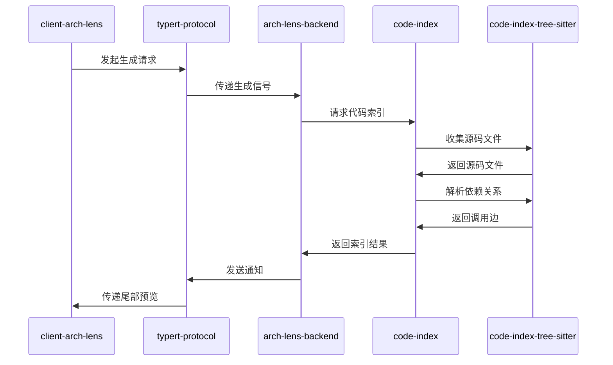

<!-- arch-lens generated · chapter=seq · language=中文 · at=2026-09-01T14:06:37.590Z · 本文件由 Arch Lens 生成并整体覆盖，请勿手改 -->

# 时序

## 时序

### 职责边界与关键路径

本系统的时序遵循“浏览器端发起 → 协议层传递 → 服务端编排 → 索引层解析”的单向依赖链。`client-arch-lens` 仅面向 `typert-protocol` 与 `arch-lens-backend`，不直接接触代码索引细节；`arch-lens-backend` 作为服务端编排者，同时依赖 `code-index` 与 `typert-protocol`；`code-index` 是语言感知的契约层，其实现由 `code-index-tree-sitter` 提供，但反向不可见（`code-index-tree-sitter` 依赖 `code-index`）。这一分层保证协议、索引实现与后端逻辑可独立演进。

### 调用关系表

实际源码中的 import 边如下：

| 调用方 | 被调用方 | 动作 |
| --- | --- | --- |
| `arch-lens-backend` | `code-index` | 请求代码索引 |
| `arch-lens-backend` | `typert-protocol` | 发送/接收协议消息 |
| `client-arch-lens` | `arch-lens-backend` | 发起远程展示请求 |
| `client-arch-lens` | `typert-protocol` | 发起生成请求 |
| `code-index-tree-sitter` | `code-index` | 实现索引契约 |

### 生成请求时序

1. **浏览器端发起**：`client-arch-lens` 面向 `typert-protocol` 发起生成请求，该请求携带远程元数据，但不包含任何代码索引语义。
2. **协议层传递**：`typert-protocol` 将生成信号转发给 `arch-lens-backend`，从而将浏览器端的请求接入服务端边界。
3. **服务端编排**：`arch-lens-backend` 接收到信号后，调用 `code-index` 请求代码索引。此步骤是后端与索引契约的唯一切入点。
4. **索引收集**：`code-index` 依据契约请求 `code-index-tree-sitter` 收集源码文件；`code-index-tree-sitter` 按语言（TypeScript/Python/Java）收集后，将源码文件返回给 `code-index`。
5. **依赖解析**：`code-index` 继续要求 `code-index-tree-sitter` 解析依赖关系；`code-index-tree-sitter` 返回调用边（实体间的导入与调用关系）。
6. **结果回传**：`code-index` 将包含实体与调用边的索引结果返回给 `arch-lens-backend`。
7. **协议通知**：`arch-lens-backend` 通过 `typert-protocol` 向 `client-arch-lens` 发送通知，告知结果已就绪。
8. **尾部预览**：`typert-protocol` 将尾部预览数据传递给 `client-arch-lens`，供其展示给用户。

### 设计取舍

- 所有跨层交互均通过 `typert-protocol` 与 `code-index` 两个接缝完成：前者隔离了编译器相关的远程序列化，后者隔离了语言解析实现。
- `arch-lens-backend` 不直接调用 `code-index-tree-sitter`，反向也不允许，因此索引实现细节被完全封装在 `code-index` 契约之后。
- 时序中不出现“生成”后的进一步持久化或查询操作，事实范围内仅记录到尾部预览为止，故相关环节未写入。
- 该时序保证了浏览器端、协议层、服务端、索引层的依赖方向始终向前，避免了循环依赖，也便于后续替换 `code-index` 的其他实现。

## 图示

