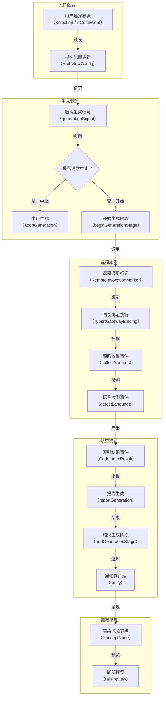
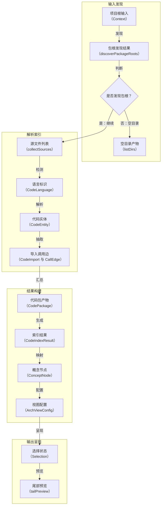
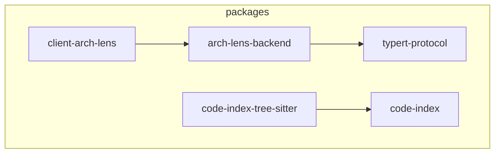
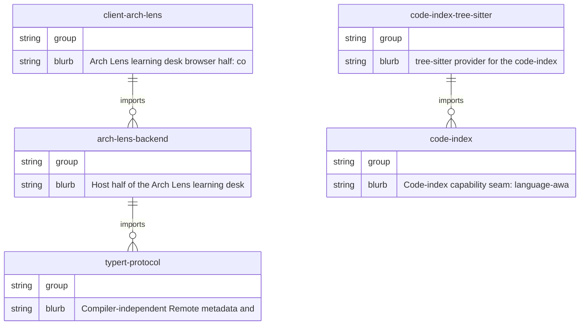

<!-- arch-lens generated -->

# 架构文档

> 由 Arch Lens 从图缓存组装生成（零 LLM 正文；缺失/过期的图先经各自的构建链补齐再组装）。共 7 节。

## 概念层级

- **运行入口与边界** — 聚合后端服务、客户端视图和远程协议的入口，界定系统启动与外部交互边界。；内部：arch-lens-backend, client-arch-lens, typert-protocol
  - **后端入口** — 加载生成调度、通知、阶段管理和预览能力。；内部：arch-lens-backend
  - **客户端入口** — 暴露架构视图组件、配置和选择模型。；内部：client-arch-lens
  - **协议入口** — 提供远程方法标记、网关绑定和初始化上下文。；内部：typert-protocol
- **架构生成调度** — 以后端为核心管理一次架构索引或生成过程的生命周期。；内部：arch-lens-backend
  - **生成信号与并发槽位** — 通过 generationSignal、abortGeneration、slotFor、notify 控制任务触发、中止与资源分配。；内部：arch-lens-backend
  - **阶段报告** — 通过 beginGenerationStage、reportGeneration、endGenerationStage 跟踪生成阶段。；内部：arch-lens-backend
  - **预览输出** — 通过 tailPreview 提供生成结果尾部预览。；内部：arch-lens-backend
- **代码索引构建** — 从源码发现、语言识别到结构化索引生成。；内部：code-index-tree-sitter, code-index
  - **源码发现与解析** — detectLanguage、discoverPackageRoots、collectSources 等负责扫描源码并解析语法。；内部：code-index-tree-sitter
  - **索引数据模型** — CodeEntity、CodePackage、CodeImport、CallEdge、CodeIndexResult 描述代码结构。；内部：code-index
- **前端架构视图** — 面向用户的架构图展示、选择与动态交互。；内部：client-arch-lens
  - **视图配置与概念树** — ArchViewConfig、ConceptNode、FigureGranularity 控制展示层级和粒度。；内部：client-arch-lens
  - **选择与动态目标** — Selection、DynamicKind、DynamicTarget 处理用户选择和动态视图目标。；内部：client-arch-lens
  - **客户端事件** — CoreEvent 承载视图交互事件。；内部：client-arch-lens
- **远程协议与网关绑定** — 定义远程方法调用标记、绑定选项和初始化上下文。；内部：typert-protocol
  - **远程方法标记** — RemoteMethodMarker、StoredRemoteMethodMarker、RemoteInvocationMarker 描述可远程调用的方法。；内部：typert-protocol
  - **网关绑定** — TypertGatewayBinding 与 TypertGatewayBindingOptions 建立远程调用通道。；内部：typert-protocol
  - **初始化上下文与失败** — RemoteInitializerContext、TypertLookupFailure 处理远程初始化与查找失败。；内部：typert-protocol

## 流程图

### 事件视角：架构视图生成事件流程

> 来源：AI 归纳（非权威）

### 管线视角：代码索引与架构视图数据管道

> 来源：AI 归纳（非权威）

## 时序

1. `client-arch-lens` → `arch-lens-backend`：请求生成视图
2. `arch-lens-backend` → `typert-protocol`：绑定远程方法
3. `typert-protocol` → `code-index`：调用索引方法
4. `code-index` → `code-index-tree-sitter`：发现包根
5. `code-index` → `code-index-tree-sitter`：收集源码
6. `code-index` → `code-index-tree-sitter`：检测语言
7. `code-index-tree-sitter` → `code-index`：返回源文件
8. `code-index` → `typert-protocol`：返回索引结果
9. `typert-protocol` → `arch-lens-backend`：回传索引结果
10. `arch-lens-backend` → `client-arch-lens`：通知生成完成
11. `arch-lens-backend` → `client-arch-lens`：返回尾部预览
12. `client-arch-lens` → `arch-lens-backend`：发送选择事件
13. `client-arch-lens` → `arch-lens-backend`：请求中止生成
14. `arch-lens-backend` → `client-arch-lens`：通知中止完成

> 来源：AI 归纳（非权威）

## 核心交互

| 事件 | 模式 | 生产者 | 消费者 | 说明 |
| --- | --- | --- | --- | --- |
| 用户选择事件 | emit | client-arch-lens | arch-lens-backend | Selection 与 CoreEvent 触发后端生成请求 |
| 视图配置事件 | emit | client-arch-lens | arch-lens-backend | ArchViewConfig 与 ArchViewProps 请求架构视图 |
| 生成信号事件 | emit | arch-lens-backend | typert-protocol | generationSignal 驱动远程索引调用 |
| 中止生成事件 | emit | client-arch-lens | arch-lens-backend | abortGeneration 终止当前生成阶段 |
| 远程调用事件 | serial | typert-protocol | code-index | RemoteInvocationMarker 调用代码索引方法 |
| 网关绑定事件 | serial | typert-protocol | code-index | TypertGatewayBinding 绑定远程方法 |
| 绑定查找失败事件 | emit | typert-protocol | arch-lens-backend | TypertLookupFailure 返回远程方法查找失败 |
| 包根发现事件 | serial | code-index | code-index-tree-sitter | discoverPackageRoots 扫描项目包根 |
| 源码收集事件 | serial | code-index | code-index-tree-sitter | collectSources 收集可索引源文件 |
| 语言检测事件 | serial | code-index | code-index-tree-sitter | detectLanguage 识别 CodeLanguage |
| 索引结果事件 | waterfall | code-index | typert-protocol | CodeIndexResult 返回 CodeEntity CodeImport CallEdge |
| 生成报告事件 | emit | arch-lens-backend | client-arch-lens | reportGeneration 上报生成阶段结果 |
| 阶段结束事件 | emit | arch-lens-backend | client-arch-lens | endGenerationStage 结束生成阶段 |
| 通知事件 | emit | arch-lens-backend | client-arch-lens | notify 推送状态与 tailPreview 预览 |

## 依赖

核心包：`arch-lens-backend`、`client-arch-lens`、`code-index`、`code-index-tree-sitter`、`typert-protocol`

- `arch-lens-backend` → `code-index`
- `arch-lens-backend` → `typert-protocol`
- `client-arch-lens` → `arch-lens-backend`
- `client-arch-lens` → `typert-protocol`
- `code-index-tree-sitter` → `code-index`

## 实体关系

## 包目录职责

| 包 | 职责 |
| --- | --- |
| `arch-lens-backend` | Arch Lens 学习桌的宿主端，负责扫描工作区仓库、投影组件详情，并记录答案级 ARCH-NOTES.md。 |
| `client-arch-lens` | Arch Lens 学习桌的浏览器端，通过 archLens Host Remote 提供概念、序列、交互和目录学习单元。 |
| `code-index` | 代码索引能力接口，定义语言感知的工作区实体与导入提取契约，支撑精确架构图和基于代码的解释。 |
| `code-index-tree-sitter` | 基于 tree-sitter 的代码索引提供方，从工作区中提取 TypeScript、Python 和 Java 的实体与导入信息。 |
| `typert-protocol` | 与编译器无关的 Remote 元数据与 Typert 提供方协议，内置自 deepseek-harness 的 typert/protocol。 |
